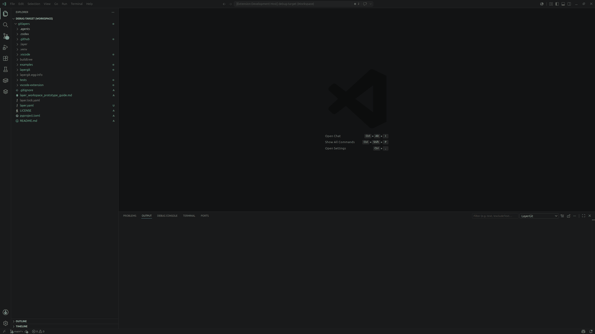

# LayerGit

LayerGit lets multiple Git repositories appear together in one generated workspace.

It is not a replacement for Git. Each layer is still a normal Git repository. LayerGit adds a generated `buildtree/` where files from those repositories are composed together in layer order, so an IDE, build system, or workflow can see one directory structure instead of several separate repos.

When two layers provide the same path, the higher layer wins by default. The lower file is masked, not deleted, and LayerGit records provenance so you can see which layer provided the visible file.

LayerGit is meant for projects where the source needs to stay split across repositories, but the tools around the project expect one shared workspace.

> Status: early prototype. Use on copied/test repositories first. LayerGit writes
> generated output to `buildtree/` and stores cloned or local layer repos under
> `.layer/cache/`.

## Why LayerGit?

LayerGit is for projects where source files live in several Git repositories, but your IDE or build system needs them to appear together in one directory tree.

The mental model is close to Photoshop-style layers. Repositories are ordered
from bottom to top. When multiple enabled layers provide the same output path,
the topmost enabled layer wins by default and lower copies are masked. Those
masked copies are not deleted; they are recorded as provenance so the generated
tree is explainable instead of mysterious.

Users can also make explicit per-file exceptions with `layer use`, choosing
which layer/repo should provide a path even when another layer would normally
mask it. That means the workspace is not just a blind flattening operation: it is
a selected composition of files from multiple repos.

Example:

```text
Layer 1: component-b provides common/util.c
Layer 2: component-c provides common/util.c
```

Because `component-c` is higher, `buildtree/common/util.c` comes from
`component-c`. The `component-b` version is masked and recorded in provenance.

## Why Not Submodules, a Monorepo, or CMake?

LayerGit is not meant to replace normal Git layouts or modern build systems. If a monorepo, package manager, submodule, subtree, or build-system dependency model works cleanly for your project, that is probably the better choice.

LayerGit is for cases where those options do not fit well because the build or development environment needs a specific source tree layout.

* **Submodules and subtrees** keep repositories at path boundaries. They are useful when one repo can live inside another directory, but they do not directly solve cases where several repos need to contribute files into the same logical tree.
* **Monorepos** are often simpler when teams can combine code history and ownership. LayerGit is for cases where repos need to remain separate but still appear together for a build, IDE, vendor SDK, or legacy workflow.
* **CMake and other build systems** can model dependencies well when the build can be changed. LayerGit is useful when the build system, IDE, or source layout is constrained and expects files to already exist in one directory structure.
* **Copying files manually** works until it becomes unclear where a file came from, which copy is authoritative, or why one file replaced another. LayerGit keeps the generated tree explainable by recording visible and masked provenance.

LayerGit is best understood as a source-tree composition tool: it creates one generated, explainable workspace from multiple Git-backed layers.

## Mental Model

LayerGit has three places you may see files:

1. `layer.yaml` is the workspace recipe.
2. `.layer/cache/<layer>/` contains normal Git repositories where source changes
   are made and committed.
3. `buildtree/` is generated output for IDEs and build tools.

`buildtree/` can be edited for IDE or build workflow convenience, but it is not the source of truth. Use `layer apply` to copy changes from `buildtree/` back into the owning layer cache repo before committing with Git.

The prototype writes:

* `layer.yaml`: user-authored manifest
* `layer.lock.yaml`: generated exact layer commits
* `.layer/cache/<layer>`: cloned or materialized source layers
* `.layer/ownership.json`: visible and masked file provenance
* `.layer/conflicts.json`: conflict and warning report for ambiguous or
  build-risk cases
* `buildtree/`: composed output tree

Every layer is Git-backed. Repo layers are cloned from an existing Git repo.
Local layers are normal layers with no remote. They are initialized as Git repos
under `.layer/cache/<layer>/` and participate in composition, masking,
provenance, and Git passthrough just like repo-backed layers.

## Quick Start

The LayerGit source checkout and the workspace you compose with LayerGit can be
different directories. Install the CLI from this repo, then run `layer init`
inside the workspace you want LayerGit to manage.

Install the CLI from a local checkout:

```bash
python3 -m venv .venv
source .venv/bin/activate
python -m pip install -e .
layer --help
```

Use one directory as the LayerGit workspace, then add existing Git repositories as
layers. Source repositories can live anywhere; LayerGit clones them into
`.layer/cache/<layer-name>/` and generates `buildtree/`.

```bash
mkdir my-layergit-workspace
cd my-layergit-workspace

layer init --output ./buildtree

# layer init creates workspace-base as a local Git-backed base layer.
# Add repo layers above it from lower priority to higher priority.
layer add ../repo-a product
layer add ../repo-b component-b
layer add ../repo-c component-c

# Optional: add a local layer for experiments or local-only edits.
layer add --local local-edits
layer write local-edits

layer status
```

`layer` is the intended installed command. The package also exposes `layergit`,
and the Python module form is useful during local development or as a fallback:

```bash
layer status
layergit status
python3 -m layergit.cli status
```

If the optional layer name is omitted, LayerGit infers a safe layer name from the
repo path or URL. Only Git-tracked files from cached layer repos are composed by
default.

Use `layer init --no-base-layer` only when you want to start with no default
`workspace-base` local layer.

## Common Workflows

Explain which layer owns the visible copy of a file:

```bash
layer explain common/util.c
```

Edit and commit inside the owning cached repo through the layer-aware Git
passthrough:

```bash
$EDITOR .layer/cache/component-b/common/util.c
layer -L component-b git status
layer -L component-b git add common/util.c
layer -L component-b git commit -m "Fix shared utility"
```

You can also edit generated files in `buildtree/` from an IDE, then ask
LayerGit to route those edits back to the owning layer cache repo:

```bash
# after editing buildtree/common/util.c
layer diff common/util.c
layer apply common/util.c

layer -L component-b git status
layer -L component-b git add common/util.c
layer -L component-b git commit -m "Fix shared utility"
```

New unowned files in `buildtree/` are routed to the configured write layer:

```bash
layer diff --new
layer apply --new
layer -L workspace-base git status
```

If no write layer is configured, create or select one explicitly:

```bash
layer add --local local-edits
layer write local-edits
```

Local layers use the same passthrough:

```bash
layer -L workspace-base git status
layer -L local-edits git status
layer -L local-edits git add .
layer -L local-edits git commit -m "Try local changes"
```

Recompose the generated tree from local cached repos:

```bash
layer compose
layer status
```

By default, `layer compose` writes current composed files, removes files LayerGit
previously owned but no longer composes, and preserves unknown files in
`buildtree/`, such as compiler outputs or IDE artifacts. Use the explicit clean
mode only when you want to rebuild the output tree from scratch:

```bash
layer compose --clean
```

Fetch or pull layers from their remotes and then recompose:

```bash
layer pull
layer pull component-b
```

Select which layer provides one overlapping file:

```bash
layer use common/util.c component-b
layer explain common/util.c
```

This pins `common/util.c` to `component-b` even if a higher layer also provides
that path. The rest of the tree still follows normal layer order.

Move a layer in the stack with `layer move <layer> <position>`:

```bash
layer move component-b up
layer move component-b down
layer move component-b top
layer move component-b bottom
```

Temporarily hide or re-enable a layer without deleting its manifest entry or
cached repo:

```bash
layer disable component-c
layer status
layer enable component-c
```

Export the current composed tree as a standalone directory or Git repo:

```bash
layer export ./merged-project --with-provenance
layer export ./merged-project --init-git
```

## Standard Git Behavior

LayerGit does not replace Git. It scopes Git.

* Use normal Git inside `.layer/cache/<layer>/` if needed.
* Prefer `layer -L <layer> git <git-command>` from the workspace root.
* You may edit `buildtree/` for IDE convenience, but use `layer apply` to copy
  those edits back into layer cache repos before committing.
* Do not commit from `buildtree/`; it is generated output.
* Run `layer compose` to regenerate `buildtree/` from the current cached layer
  repos without fetching remotes. Files LayerGit never owned are preserved unless
  you run `layer compose --clean`.

## Examples

See [examples/](examples/) for local, network-free demos. The overlap demo builds
two temporary Git repositories with the same `common/util.c`, composes them, shows
top-layer-wins provenance, switches the visible file with `layer use`, and
exports the result.

```bash
examples/overlap-demo.sh
```

## VS Code Extension

The VS Code extension provides a LayerGit Activity Bar view with:

* Layers and status
* Composed Tree
* file provenance through `layer explain`
* repo and local layer add/remove actions
* layer enable/disable actions
* write-layer selection through `layer write`
* file selection through `layer use`



The extension lives in `vscode-extension/` and is intentionally a thin GUI over the
CLI:

* Layers view calls `layer status --json`.
* Composed Tree view calls `layer tree --json`.
* Add repo layer calls `layer add <repo> [name]`.
* Add local layer calls `layer add --local <name>`.
* Set write layer calls `layer write <layer>`.
* File details call `layer explain <file> --json` and write provenance details to
  the **LayerGit** output channel.
* File and folder context actions can persist layer selections through
  `layer use`.

In the Layers view, use **Add Repo Layer** for an existing repository path or URL
and **Add Local Layer** for a new local Git-backed layer under `.layer/cache/`.
Right-click a layer and choose **Set Write Layer** to make it the target for
local edits.

### Run The Extension Locally

First install the Python CLI from the repo root:

```bash
# from the LayerGit repo root, not vscode-extension/
python3 -m venv .venv
source .venv/bin/activate
python -m pip install -e .
layer --help
```

Then install and compile the extension dependencies:

```bash
# still from the LayerGit repo root
cd vscode-extension
npm ci
npm run compile
cd ..
```

Open the repo root in VS Code, then choose **Run > Start Debugging**. VS Code
should use the checked-in **Run LayerGit Extension** launch configuration.

The checked-in debug workspace at
`.vscode/debug-target.code-workspace` gives the Extension Development Host a
distinct workspace identity while pointing at the repo root.

The extension defaults to `layer`. During local development, if the workspace has
`.venv/bin/python`, or the LayerGit source checkout has `.venv/bin/python`, the
extension automatically falls back to:

```bash
.venv/bin/python -m layergit.cli
```

After changing TypeScript, rerun `npm run compile` or leave `npm run watch`
running, then reload the Extension Development Host window. Changes to
`vscode-extension/package.json` require stopping and starting the debug session.

## Development

Run Python tests without external test dependencies:

```bash
PYTHONDONTWRITEBYTECODE=1 python -m unittest
```

Run Python coverage for the CLI and child LayerGit processes:

```bash
python -m pip install -e '.[dev]'
coverage erase
LAYERGIT_TEST_COVERAGE=1 coverage run --parallel-mode -m unittest
coverage combine
coverage report
coverage report --format=markdown > tests/coverage-summary.md
```

`LAYERGIT_TEST_COVERAGE=1` tells the test harness to run each spawned
`python -m layergit.cli` subprocess under `coverage run --parallel-mode`, so the
reported numbers include the actual CLI code paths. The checked-in snapshot is
saved at `tests/coverage-summary.md`.

Compile the VS Code extension:

```bash
cd vscode-extension
npm ci
npm run compile
```

`layer init` writes a workspace `.gitignore` for `.layer/` and the configured
output tree so standard Git from the workspace root tracks configuration and
documentation, not generated source output.

## Current Limitations

* Early prototype; test on copied repositories first.
* `buildtree/` is generated output. You may edit it for IDE/build workflow convenience, but use `layer apply` to copy changes back into layer cache repos before committing.
* The VS Code extension is currently a development extension, not a packaged
  Marketplace release.
* Conflict reporting and diagnostics are still evolving.

## Feedback

LayerGit is an early prototype. I am sharing it to see whether this layered workspace model is useful to others.

Feedback, issues, real-world examples, and suggestions are welcome and will help guide future development.

## License

LayerGit is licensed under the Apache License 2.0. See [LICENSE](LICENSE).
